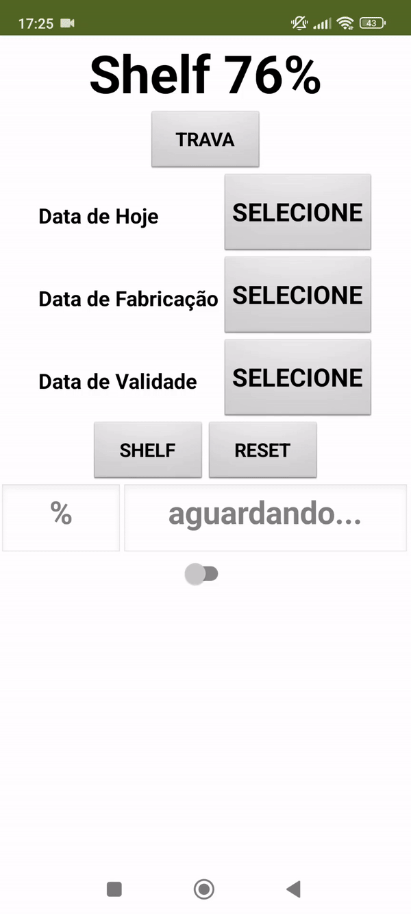

# Calculadora de Shelf Life 🧮

Desenvolvi essa aplicação afim de tornar o processo de recebimento mais dinâmico e rápido, sendo as diretrizes e processos estabelecidos pela empresa.
Decidi criar uma "calculadora de mão", considerando que os operadores sempre tinha consigo acesso a um tablet.
Foi ótimo ter essa calculadora como ferramenta de trabalho, pois além de facilitar o processo de validação do recebimento da carga, foi pensada para fácil operação.
Posteriormente, o time tech desenvolveu uma aplicação que é utilizada até hoje, a partir desse protótipo e minha ideação, levando em considerações melhorias que indiquei, mas não tive oportunidade de conseguir implementar nessa "primeira versão".

## Objetivo do Projeto 🎯

- Facilitar meu trabalho quando validava o recebimento de produtos perecíveis;
- Fins de estudo e documentação do meu desenvolvimento pessoal;
- Fixar conceitos;
- Treinar "boas maneiras/práticas" na programação.

## Tecnologias Utilizadas 💻

- MIT App Inventor

## Demo 📷

  

